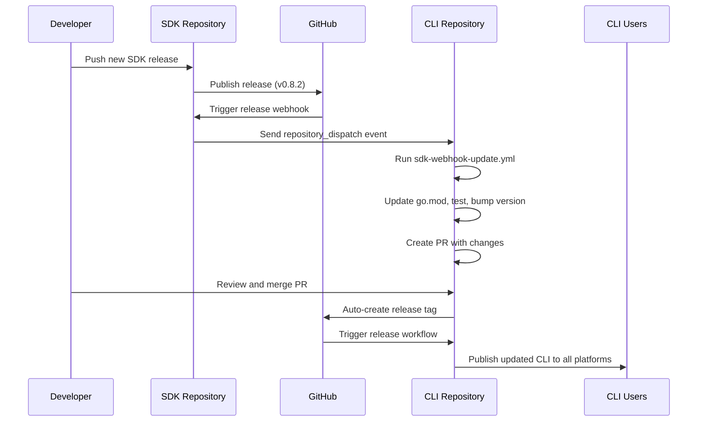

# Webhook Setup for SDK Auto-Updates

This guide explains how to set up webhooks so the CLI automatically updates when the [Vapi Go SDK](https://github.com/VapiAI/server-sdk-go) releases a new version.

## Overview

Instead of daily cron jobs, we use GitHub webhooks to get notified **immediately** when a new SDK release is published. This is more efficient and responsive.

## Setup Instructions

### 1. Add Webhook to SDK Repository

**Location**: [VapiAI/server-sdk-go](https://github.com/VapiAI/server-sdk-go) → Settings → Webhooks

1. **Go to SDK Repository Settings**:

   - Navigate to https://github.com/VapiAI/server-sdk-go/settings/hooks
   - Click **"Add webhook"**

2. **Configure Webhook**:

   ```
   Payload URL: https://api.github.com/repos/VapiAI/cli/dispatches
   Content type: application/json
   Secret: [Optional - leave empty for now]
   ```

3. **Select Events**:

   - ✅ **Releases** (only select this one)
   - ❌ Uncheck everything else

4. **Set to Active**: ✅ Active

5. **Add webhook**

### 2. Configure Webhook Payload

The webhook needs to send a `repository_dispatch` event to the CLI repository. Add this as a GitHub Action in the SDK repository:

**File**: `.github/workflows/notify-cli-on-release.yml` in the SDK repo

```yaml
name: Notify CLI on Release

on:
  release:
    types: [published]

jobs:
  notify-cli:
    runs-on: ubuntu-latest
    steps:
      - name: Notify CLI repository
        run: |
          curl -X POST \
            -H "Accept: application/vnd.github.v3+json" \
            -H "Authorization: token ${{ secrets.CLI_DISPATCH_TOKEN }}" \
            https://api.github.com/repos/VapiAI/cli/dispatches \
            -d '{
              "event_type": "sdk-release",
              "client_payload": {
                "tag_name": "${{ github.event.release.tag_name }}",
                "html_url": "${{ github.event.release.html_url }}",
                "body": "${{ github.event.release.body }}",
                "prerelease": ${{ github.event.release.prerelease }},
                "draft": ${{ github.event.release.draft }}
              }
            }'
```

### 3. Set Up GitHub Token

The SDK repository needs a token to trigger the CLI webhook:

1. **Create Personal Access Token**:

   - Go to GitHub Settings → Developer settings → Personal access tokens → Tokens (classic)
   - Generate new token with `repo` scope
   - Copy the token

2. **Add Secret to SDK Repository**:
   - Go to SDK repository → Settings → Secrets and variables → Actions
   - Click **New repository secret**
   - Name: `CLI_DISPATCH_TOKEN`
   - Value: [paste the token]

## How It Works



## Testing the Webhook

### 1. Manual Test

You can manually trigger the webhook update workflow:

```bash
# Test with specific version
gh workflow run sdk-webhook-update.yml --field sdk_version=v0.8.1

# Test with latest version
gh workflow run sdk-webhook-update.yml --field force_update=true
```

### 2. End-to-End Test

1. Create a test release in the SDK repository
2. Verify the CLI webhook workflow triggers
3. Check that a PR is created in the CLI repository
4. Merge the PR and verify release is created

## Monitoring

### Webhook Delivery

Check webhook deliveries in the SDK repository:

- Go to Settings → Webhooks → [Your webhook]
- Click on "Recent Deliveries"
- Verify successful 200 responses

### CLI Workflow Status

Monitor the CLI repository workflows:

- Go to Actions tab in CLI repository
- Look for "SDK Webhook Update" workflows
- Check logs for any failures

### Fallback Safety Net

A weekly fallback check runs on Sundays at 3 AM UTC:

- Verifies CLI is up to date with latest SDK
- Triggers manual update if webhooks failed
- Located in `.github/workflows/sdk-fallback-check.yml`

## Troubleshooting

### Common Issues

1. **Webhook not triggering**:

   - Check webhook configuration in SDK repo
   - Verify `CLI_DISPATCH_TOKEN` secret is set
   - Check webhook delivery logs

2. **CLI workflow fails**:

   - Check GitHub Actions logs
   - Verify `make test` and `make lint` pass
   - Ensure no merge conflicts

3. **Permission errors**:
   - Verify token has `repo` scope
   - Check repository permissions

### Manual Override

If webhooks fail, you can always trigger updates manually:

```bash
# Check for updates
./scripts/check-sdk-update.sh

# Force update
./scripts/check-sdk-update.sh --update

# Trigger workflow manually
gh workflow run sdk-webhook-update.yml
```

## Benefits of Webhook Approach

✅ **Instant Updates**: No waiting up to 24 hours  
✅ **Resource Efficient**: No unnecessary daily checks  
✅ **Reliable**: Webhook + weekly fallback  
✅ **Detailed Info**: Full release notes in PR  
✅ **Scalable**: Works for any number of SDK releases

## Security Notes

- Webhook payloads are public (no sensitive data)
- Token only has access to trigger CLI workflows
- All changes go through PR review process
- Tests must pass before any updates are applied
